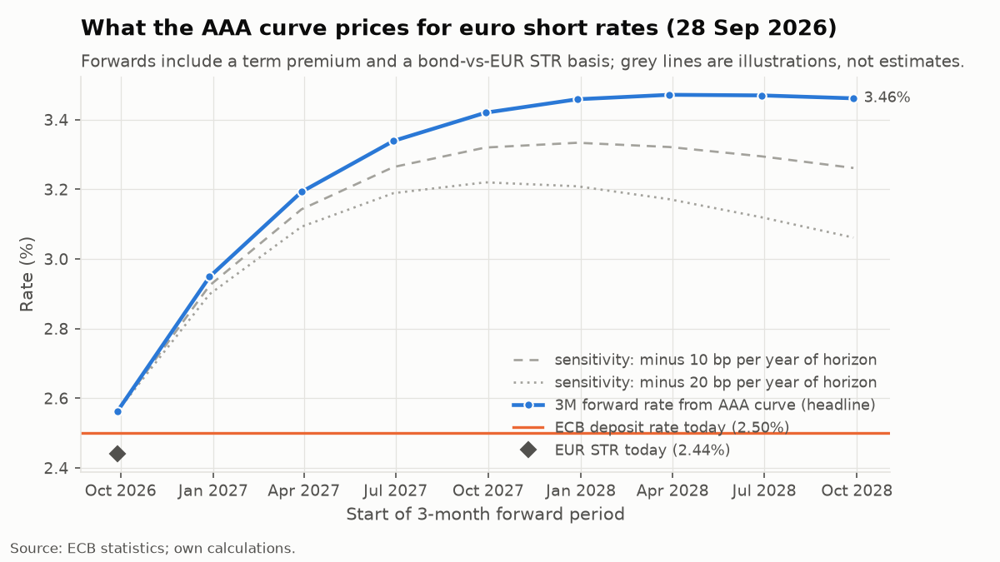
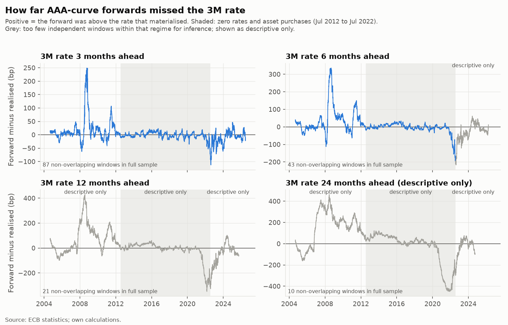
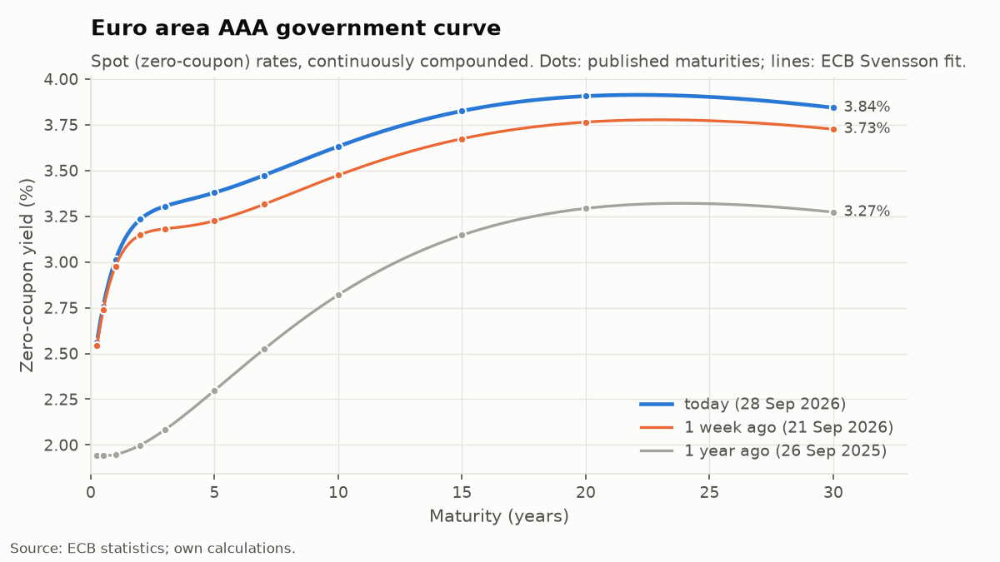
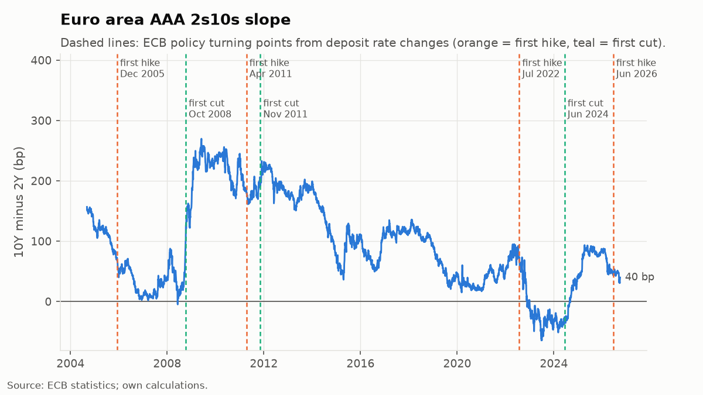
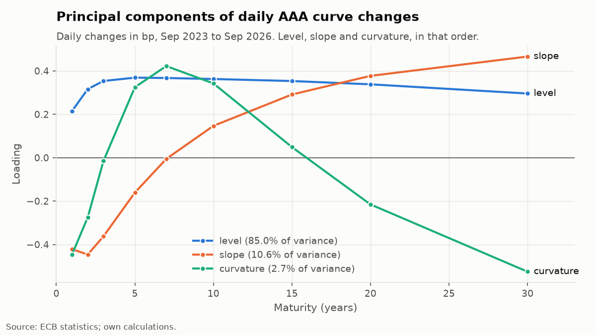
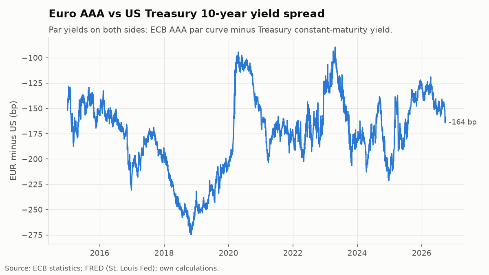

# euro-rates-monitor

[](https://github.com/lapomazzari/euro-rates-monitor/actions/workflows/tests.yml) [](https://github.com/lapomazzari/euro-rates-monitor/actions/workflows/weekly-data-refresh.yml)

Tracks the euro area government curve, extracts what it prices for ECB policy, and computes the figures and chart for a one-page weekly market note.

<!-- headline:start -->
## Headline (curve as of 28 Sep 2026)

- **Forwards vs a random walk.** Since Sep 2004, the AAA curve's 3M forwards have **not beaten a naive random walk** by a statistically significant margin at any horizon tested (3M, 6M, 12M). Forward RMSE was 0.92, 0.90, 0.91 times the random walk's (Diebold-Mariano p = 0.40, 0.30, 0.31). At 24M the sample is too short for inference. See [What the forwards have been worth](#what-the-forwards-have-been-worth).
- **ECB pricing.** The AAA curve's 3-month forwards imply a short rate of **3.42% in 1 year** and **3.46% in 2 years**, against a deposit rate of **2.50%** (92bp and 96bp above it).
  - Measured from the curve's own 3M rate (2.56%, 12bp above €STR), the 1-year forward is 86bp above today.
  - Forwards include a term premium (see [Limitations](#limitations)).
- **Curve level.** The 10Y AAA yield is **3.63%**, at the top of its one-year range.
- **Sovereign spread.** The all-issuer vs AAA spread at 10Y is **50bp**, at its one-year high.
- **Data retrieved.** ECB Data Portal 2026-09-30; FRED 2026-09-30; Fed Board 2026-09-30. Stale = retrieved more than 3 days before this build (run 2026-09-30).
<!-- headline:end -->

Notes: [`notes/`](notes/). The headline above is regenerated each week by `erm readme`.



## Run it

Python 3.12 or later (numpy 2.5 and pandas 3.0 require it). Tested on 3.12 in CI and 3.13 locally.

```bash
python3.12 -m venv .venv && source .venv/bin/activate
pip install -r requirements.lock && pip install --no-deps -e .

erm fetch            # download every series into data/raw/<source>/<name>_<date>.csv
erm fetch-summary    # the last fetch as a table: fresh, served from cache, or missing
erm build            # analytics -> data/processed/ (metrics_latest.json feeds the note)
erm report           # charts -> figures/, plus a summary on stdout
erm note             # scaffold for this week's note -> notes/<date>.md, to fill in by hand
erm check-note notes/  # every number and date in each note must be in its figures file
erm note --llm       # optional: Claude drafts the prose instead (needs ANTHROPIC_API_KEY)
erm backtest         # forwards vs realised 3M rate -> data/processed/backtest_*, figures/
erm readme           # refresh the headline at the top of this README
pytest               # curve maths, PCA, change logic, backtest, number and date check
```

To re-run the walkthrough notebook: `pip install -e ".[notebook]"`, then open `notebooks/walkthrough.ipynb`.

*Troubleshooting (macOS):* if `erm` or the notebook reports `No module named 'euro_rates_monitor'` after installing, macOS has marked the install's `.pth` file as hidden, and Python 3.13 skips hidden `.pth` files. Fix: `chflags nohidden .venv/lib/python3.*/site-packages/*.pth`.

**Keys and settings (all optional):**

| Variable | What it does | Without it |
|---|---|---|
| `FRED_API_KEY` | `fetch` uses the official FRED API ([free key](https://fred.stlouisfed.org/docs/api/api_key.html)). | `fetch` falls back to FRED's public CSV download (`fredgraph.csv`). Same data, same cache format. |
| `ANTHROPIC_API_KEY` | `erm note --llm` has Claude draft the prose. | Everything else works; `erm note` writes the scaffold. |
| `ERM_MODEL` | Changes the model. | Default: `claude-opus-5-5`. |
| `ERM_FETCH_BUDGET_S` | Caps the whole fetch step, in seconds. | Default: 300. |

The optional LLM call enables Anthropic's server-side fallback: if a safety classifier declines the request, it is re-run on a fallback model instead of failing.

## The weekly note

The committed notes in `notes/` are written by hand from the figures `erm build` computes; `erm note` produces a scaffold with those figures, the dates and the chart, and a placeholder wherever prose goes. `erm check-note` extracts every number and date from a note and fails, listing the unmatched tokens, if any is not in that week's `data/processed/metrics_<date>.json`; CI runs it on every note. An optional LLM drafting mode (`erm note --llm`) exists behind that flag, and its output is marked unreviewed so it cannot pass the check until it has been edited by hand.

**Continuous integration.** [`tests.yml`](.github/workflows/tests.yml) runs ruff, the test suite and `erm check-note notes/` on every push. It works offline, from the committed sample and processed data.

**Weekly refresh.** [`weekly-data-refresh.yml`](.github/workflows/weekly-data-refresh.yml) runs every Saturday. It refreshes the data, figures and README headline and commits those; it writes that week's scaffold as a downloadable run artifact and never commits a note.
- *Where the cache comes from:* the raw download cache is git-ignored, so a fresh runner would have nothing to fall back on. The workflow therefore **restores `data/raw/` from the `raw-cache` artifact of the last successful run** before fetching, and uploads the updated cache for the following week. An artifact (30-day retention) is used rather than `actions/cache`, whose 7-day eviction a weekly schedule would hit exactly.
- *FRED:* an optional `FRED_API_KEY` repository secret switches FRED from the public CSV download to its official API.
- *Limits:* two optional repository variables, `ERM_FETCH_BUDGET_S` (default 300 seconds) and `ERM_JOB_TIMEOUT_MIN` (default 10 minutes), cap the fetch step and the whole job.
- *Summary:* every run, including failed ones, writes the fetch report to the run's summary page as a table.

## What the forwards have been worth

**The forwards have not beaten a random walk by a statistically significant margin.** From September 2004, at 3, 6 and 12 months ahead, the AAA curve's 3M forward had an RMSE 8–10% lower than simply assuming today's 3M rate persists (ratios 0.92, 0.90 and 0.91), but Diebold–Mariano tests cannot tell that apart from noise (p = 0.40, 0.30 and 0.31). The average error, forward minus realised, which is the empirical term premium, was +4bp, +7bp and +13bp. All three 95% intervals include zero, and each is about a fifth of the typical realised move over the same window. At 24 months there are only 10 independent two-year windows, so no statistic is reported.



**Mean error, forward minus realised, in bp**, with its Newey-West 95% interval, as a share of the mean absolute realised move, and the number of non-overlapping windows:

| Sample | 3M | 6M | 12M | 24M |
|---|---|---|---|---|
| Full sample | +4 [-3, +11]; 19% of move (87 win.) | +7 [-10, +23]; 17% of move (43 win.) | +13 [-27, +53]; 19% of move (21 win.) | withheld (10 win.) |
| Pre-lower-bound | +19 [+2, +37]; 72% of move (31 win.) | +38 [+4, +71]; 79% of move (15 win.) | withheld (7 win.) | withheld (3 win.) |
| Zero rates and asset purchases | -1 [-5, +2]; -15% of move (40 win.) | -4 [-14, +5]; -26% of move (20 win.) | withheld (10 win.) | withheld (5 win.) |
| Hiking and after | -13 [-23, -2]; -33% of move (16 win.) | withheld (7 win.) | withheld (3 win.) | withheld (1 win.) |

**Accuracy against the random walk**: RMSE ratio (below 1 favours the forwards) with the Diebold–Mariano p-value, and the direction hit rate against the base rate of the most common direction:

| Sample | 3M | 6M | 12M | 24M |
|---|---|---|---|---|
| Full sample | 0.92 (p 0.40); hits 66% vs 53% (87 win.) | 0.90 (p 0.30); hits 66% vs 50% (43 win.) | 0.91 (p 0.31); hits 67% vs 51% (21 win.) | withheld (10 win.) |
| Pre-lower-bound | 1.10 (p 0.25); hits 62% vs 57% (31 win.) | 1.08 (p 0.14); hits 56% vs 55% (15 win.) | withheld (7 win.) | withheld (3 win.) |
| Zero rates and asset purchases | 0.75 (p 0.26); hits 60% vs 56% (40 win.) | 0.75 (p 0.25); hits 67% vs 56% (20 win.) | withheld (10 win.) | withheld (5 win.) |
| Hiking and after | 0.56 (p 0.06); hits 85% vs 62% (16 win.) | withheld (7 win.) | withheld (3 win.) | withheld (1 win.) |

**What this supports:**
- Over two decades, the AAA forwards were not a reliably better forecast of the 3M rate than no change. The point estimates favour them, but not by more than chance allows.
- The premium is not stable across regimes:
  - *Before 2012:* forwards sat above the outcome on average (+19bp at 3M, +38bp at 6M; both intervals exclude zero, and so do the bootstrap intervals).
  - *Zero-rate years:* the premium was indistinguishable from zero, mostly because the rate barely moved.
  - *Since the July 2022 hike:* the 3M forward has undershot by 13bp on average. That is a negative ex-post error: the curve underpriced the hikes.
- The forwards got the direction right about two-thirds of the time, against a base rate near one half. This is descriptive only; no test is applied to it.

**What it does not support:**
- An estimate of today's term premium to subtract from today's forwards.
- A claim that forwards are useless.
- Any statement at 24 months, where the errors are large and dominated by two episodes: forwards about 460bp too high in mid-2008 and about 450bp too low in late 2021 (see the chart).
- Eight cells are tested. With that many tests, one p-value near 0.06 (the hiking-period 3M cell) is what chance alone would often produce.

**Why forwards still matter.** A forward is not a forecast. It is the rate at which the market will trade with you today, so it is what a hedge costs, whatever its record as a predictor. A client fixing floating-rate exposure locks in the forward path, strictly the swap curve's rather than these government-curve forwards, and the backtest shows how far that price has historically been from the rate that followed.

**Method.** At each date, the 3M forward starting in h months (from `forwards.py`, the same code the live tool uses) is compared with the published AAA 3M rate h calendar months later. The random walk predicts today's 3M rate and is scored on the same dates.
- *Standard errors:* errors from overlapping h-month windows are autocorrelated, so they use Newey-West with lag h, with a moving-block bootstrap as a cross-check (both in `data/processed/backtest_summary.csv`).
- *Withheld cells:* no statistic is reported below 12 non-overlapping windows. That threshold is a judgement call, and the window count is printed in every cell.
- *Monthly statistics, daily chart:* statistics use month-end forecast dates, while the chart plots every day. That is why the chart is denser than the tables: consecutive daily forecasts share almost all of their window, so they add little independent information.
- *Regimes:* derived from the deposit rate and assigned by forecast date.
- *Direction hit rate:* excludes cases where the rate moved less than 5bp.
- *Refresh:* run `erm backtest` to update the results. It also writes the daily errors behind the chart to `data/processed/backtest_errors.csv`. That file is generated and not committed; only the summary is.

## Method

Everything is computed from the **ECB AAA curve** unless stated otherwise. The all-issuer curve is used for comparison.

**1. Curve state.**
- *How the curve is built:* the ECB fits a Nelson-Siegel-Svensson curve to euro area central government bonds between 3 months and 30 years, and publishes both the six parameters and the continuously compounded spot rates. We evaluate the parameters directly. A test checks this reproduces the published spot rates to within 1e-6.
- *Summary measures:*
  - level = 10Y
  - slopes = 2s10s and 10s30s
  - curvature = the 2s5s10s butterfly (2×5Y − 2Y − 10Y; positive means the 5Y is high relative to the wings)
- *Context:* each measure is shown against its own one-year range.

**2. Implied forwards and the ECB path.**
- *Formula:* with continuous compounding, f(t1,t2) = (r2·t2 − r1·t1)/(t2 − t1). This is the rate that makes rolling from t1 to t2 equivalent to investing to t2 directly.
- *The path:* 3-month forwards starting every quarter out to 2 years form the path the curve prices for the 3M rate.
- *Two comparisons:*
  - against the deposit rate (the ECB's steering rate);
  - against the curve's own 3M rate, which removes a constant gap between government bonds and €STR.
- *Sensitivity:* the chart also shows forwards minus 10bp and 20bp per year of horizon. These lines show how much a term premium could change the reading and are never the headline (see [Limitations](#limitations)).

**3. PCA.**
- *Setup:* principal components of daily changes (bp) at 1–30Y over the last three years. On the current window the first three explain **98.2%** of daily variance (85.0 / 10.6 / 2.7).
- *Check that they are level, slope and curvature:* the number of sign changes in each loading vector is 0, 1 and 2 respectively. The tests check this on a synthetic curve with known structure.
- *Curve-shape anomaly:* the residual after three factors, as a z-score, shows where today's curve shape departs from its usual structure (see Limitations for why it is not rich/cheap).

**4. Cross-market.**
- *Maturity spreads:* EUR AAA **par** yields minus US Treasury constant-maturity yields, which are also par yields, so like is compared with like.
- *Implied paths:* ECB zero curve against the Fed Board's Gürkaynak–Sack–Wright zero curve.
- *EUR/USD:* against the 2Y and 10Y differentials, with rolling 3M and 1Y correlations of daily changes, and a 1-year regression of the level on the 2Y differential. The regression is descriptive, not a fair value.
- *Sovereign credit:* the all-issuer minus AAA spread at 5Y and 10Y is tracked as a euro area sovereign credit / fragmentation indicator.

**5. Real rates.** Two euro area proxies, both labelled:
- *Realised:* 10Y AAA minus the latest HICP y/y.
- *Survey:* 10Y AAA minus the ECB Survey of Professional Forecasters' longer-term expectation.
- *US comparison:* the TIPS real yield, which is market-based.

Current values are in `data/processed/metrics_latest.json`.

**6. Weekly and monthly changes.** Latest value minus the last value on or before the same calendar date one week or one month earlier. This is robust to TARGET2 and US holidays. If the base value is more than 5 days stale, the change is reported as missing rather than silently covering a longer window.

**ECB policy turning points** on the 2s10s chart come from the deposit rate series itself: the first hike after a cutting phase, and vice versa. One rule applies: a change that reverses the previous change within 7 days is a corridor adjustment, not a turn (9 Oct 2008).

| | |
|---|---|
|  |  |
|  |  |

## Limitations

- **Term premium.** Forwards = expected short rate + term premium. The premium cannot be observed.
  - It is not linear in the horizon.
  - It varies over time.
  - Model estimates have been negative in some periods (e.g. during large-scale asset purchases).

  The k = 0/10/20bp-per-year lines are a sensitivity illustration, not an estimate. Read the path as "what is priced", not "what the market expects".
- **Overlapping windows in the backtest.** Monthly forecasts of a 12-month outcome share 11 months of their window, so the errors are strongly autocorrelated. Standard errors computed as if the observations were independent would be several times too small. Newey-West and the block bootstrap correct for this only approximately, and both become unreliable with few independent windows. That is why cells with fewer than 12 are withheld.
- **A short sample relative to rate cycles.** About 22 years of data hold three or four ECB cycles, so a handful of episodes (2008, the 2011 hikes, 2022) drive the averages. One more surprise of that size could change the conclusions. The 24-month horizon has only 10 independent windows in total.
- **A past premium is not the current one.** The backtest's average error mixes the term premium with surprises in the rate path and with changes in the gap between bills and €STR. It also changed sign across regimes. It is an average of the past, not an estimate of the premium in today's curve, and it does not calibrate the k = 10/20bp sensitivity lines.
- **Government curve, not OIS.** Desks read ECB pricing from €STR swaps and ECB-dated €STR forwards, which have no stable free source. Government bills and bonds can trade away from €STR because of collateral scarcity and supply; the gap reached several tens of bp in 2022. The note prints today's gap between the 3M AAA rate and €STR, and the path relative to the curve's own 3M rate. That removes a *constant* gap, not a changing one.
- **AAA vs all-issuer curves.**
  - The AAA curve uses only bonds rated AAA by Fitch. Its country composition changes when ratings change, which moves the curve (and the AAA vs all-issuer spread) without any market move.
  - The all-issuer curve includes lower-rated sovereigns, so it carries credit and liquidity premia and is not a risk-free curve.
  - Neither is a single country's curve.
- **Fitted, not traded.** The ECB curve smooths across bonds, so it cannot show which individual bond is rich or cheap. The PCA residual is labelled "curve-shape anomaly" for that reason.
- **Data revisions and timing.**
  - HICP is first published as a flash estimate and can be revised.
  - ECB and FRED series can be revised or re-based. Each download is stored with its retrieval date and SHA-256 hash in `data/raw/manifest.jsonl`, so a note can be traced to the exact data.
  - Euro and US data are fixed at different times of day.
  - The Fed Board zero curve is published with a lag of about 1–2 weeks. The note states each as-of date.
- **Realised inflation is not an expectation.** The realised-inflation real rate is backward-looking and moves with energy prices and base effects. The SPF measure looks forward but is a quarterly survey of forecasters, not a market price. No free euro area inflation-swap or breakeven series exists; the US side does have one (TIPS), so the two sides are not measured the same way.

## Data and licences

- **Sources:** every series, with identifier, source, URL and licence, is listed in [SOURCES.md](SOURCES.md), which is generated from [`sources.py`](src/euro_rates_monitor/sources.py).
- **Licences:** ECB statistics may be reused with the source quoted; US series are public domain.
- **When a download fails:** it is retried only if it can recover (timeouts, connection errors, 429, 5xx), then served from the latest cached copy and flagged stale in the metrics, the note and the README headline if retrieved more than 3 days before the build; a section with no data at all is marked unavailable, never filled with old numbers. Only the four series the euro analysis needs (AAA curve, its parameters, deposit rate, €STR) can make `erm fetch` fail.
- **What is committed:** the raw cache (about 36MB) is not committed. `data/sample/` holds the last 60 observations of each raw file, unmodified. `data/processed/` holds the derived tables, except the daily backtest errors, which `erm backtest` regenerates.
- **Left out:** swap rates, Bund futures and euro area inflation swaps, because no stable free source with clear terms exists. They are not approximated.

**Possible extension: individual Bund yields.** The Bundesbank publishes daily *observed* yields of the current 2/5/7/10/15/20/30Y Federal securities through a free API (dataflow `BBSSY`, e.g. `BBSSY/D.REN.EUR.A630.000000WT1010.A` for the 10Y, back to 2001, with the current ISIN in the metadata). That would allow a genuine bond-versus-curve comparison. Caveats:
- the series follow the *current* benchmark, so residual maturity jumps at each new issue;
- Germany only, against a multi-country AAA curve;
- the prices are fixed around noon Frankfurt time.

## Layout

```
src/euro_rates_monitor/
  sources.py      series catalogue (ids, URLs, licences) -> SOURCES.md
  fetch.py        downloads, retries, cache fallback, fetch report
  load.py         parse cached files
  curve.py        Svensson evaluation, level/slope/curvature, ranges
  forwards.py     forward rates, ECB path, term-premium scenarios
  pca.py          PCA on daily changes, curve-shape anomaly
  crossmarket.py  EUR vs US, EUR/USD vs differentials, AAA vs all-issuer
  realrates.py    realised and survey-based real rates
  changes.py      holiday-robust 1w / 1m changes
  freshness.py    retrieval age (stale flag) vs last observation, per series
  backtest.py     forwards vs realised 3M rate, Newey-West, regimes
  build.py        runs everything, writes data/processed/ and metrics_latest.json
  headline.py     README headline from the latest metrics (erm readme)
  charts.py       the five charts
  note.py         scaffold, optional LLM draft, number and date check (check-note)
  cli.py          erm fetch | fetch-summary | build | report | backtest | readme | note |
                  check-note | sources
tests/            pytest suite
notebooks/        walkthrough.ipynb: each calculation step by step
scripts/          make_sample.py
```

## Licence

Code: [MIT](LICENSE). Data belong to their publishers and are reused under the terms listed in [SOURCES.md](SOURCES.md).
