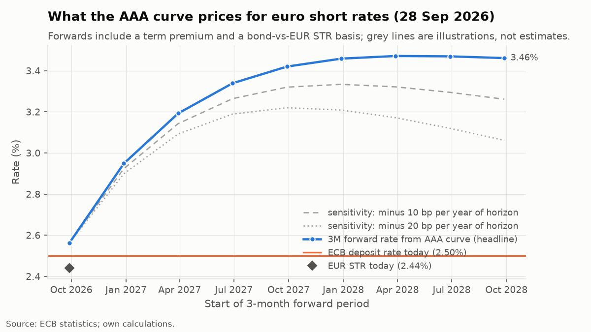

# Euro rates weekly: 28 September 2026

## What moved this week

- **EUR-US 10Y spread: -164bp, down 13bp**, 2.5 times a typical weekly move. Euro yields rose, but Treasury yields rose more, so the euro discount widened. The 2Y spread did the same, down 8bp to -169bp.
- **AAA 10Y: 3.63%, up 16bp** (2.3 times a typical week), and up 35bp over the month. It ends the week at the top of its 1-year range of 2.63 to 3.63%.
- **2s5s10s butterfly: -11bp, up 6bp.** The 5Y (+15bp) lagged the wings (2Y +9bp, 10Y +16bp), leaving the fly near the top of its 1-year range of -28 to -8bp.

This was mostly imported. Euro yields moved, but the widening spread says the impulse came from the US and the euro area followed.

## What the curve prices for the ECB

The AAA curve's 3M forwards put the short rate at 3.19% in 6M, 3.42% in 1Y and 3.46% in 2Y, against a 2.50% deposit rate: 69bp, 92bp and 96bp above it. The path is front-loaded and flat beyond 1Y, and it moved up this week, by 10bp at 1Y and 19bp at 2Y. Measured from the curve's own 3M rate (2.56%, 12bp above €STR), the 1Y forward is still 86bp higher, so this is not an artefact of where government paper trades against €STR. These are forwards, not forecasts: they contain a term premium, and in my backtest they have not beaten a random walk by a significant margin.

## The tension worth watching

Three things are at the top of their 1-year ranges at once: the 10Y yield, the priced ECB path, and the all-issuer minus AAA spread, which widened 4bp to 50bp at 10Y and 1bp to 30bp at 5Y. That combination is unusual. If yields were rising on a stronger growth or inflation picture, sovereign spreads would more often compress rather than widen. Two readings fit: the market is adding a fiscal or supply premium to weaker issuers, or this is mechanical pressure from heavy issuance. This dataset cannot separate the two, but it is the first thing I would check next week: whether the spread keeps widening while the curve sells off, or whether it retraces once the US-led move settles.

## Cross-asset

**FX.** EUR/USD fell 0.9% on the week to 1.1355 (down 2.5% over the month) while the 2Y differential moved 8bp against the euro. The direction fits, the relationship does not: the correlation of daily changes with the 2Y differential is -0.06 over 3M and -0.22 over 1Y, and the 1-year fit has an R-squared of only 0.14, with EUR/USD sitting 1.3% below it. Rates are not what is driving the currency at the moment, and I would not explain this week's move with them.

## For a client hedging floating-rate exposure

A client paying floating on euro short rates pays close to €STR, 2.44% today. Fixing got more expensive this week: the curve now prices the 3M rate at 3.42% in 1Y, 10bp higher than last week, and the AAA 2Y yield of 3.23% sits 79bp above €STR as a rough gauge of the two-year cost (an actual hedge prices off the €STR swap curve, which is not in this dataset). So the question is not whether rates are rising, but whether the client thinks the ECB will do less than the 92bp above the deposit rate already priced at the 1Y point. If yes, staying floating is the cheaper bet. If they simply cannot carry the risk of being wrong, the decision is about the size of that gap, not the direction.

## Figures (computed by `erm build`)

Every figure below is in `data/processed/metrics_2026-09-28.json`.

**What moved** (largest 1W changes relative to a typical week over the past year)

| Measure | Latest | 1W change | Size vs typical week |
|---|---|---|---|
| EUR-US 10Y spread | -164bp | -13bp | 2.5x |
| AAA 10Y yield | 3.63% | +16bp | 2.3x |
| 2s5s10s butterfly | -11bp | +6bp | 2.3x |

**ECB pricing**: deposit rate 2.50%, EUR STR 2.44% (-6bp vs deposit rate), AAA 3M 2.56% (+12bp vs EUR STR).

| 3M forward starting | Level | vs deposit rate | vs curve's 3M rate | 1W change |
|---|---|---|---|---|
| in 6M | 3.19% | +69bp | +63bp | +3bp |
| in 1Y | 3.42% | +92bp | +86bp | +10bp |
| in 2Y | 3.46% | +96bp | +90bp | +19bp |

Term-premium sensitivity only, never the headline: 3M forward in 2Y minus 10bp per year of horizon 3.26%, minus 20bp per year 3.06%.

**Curve**

| | Latest | 1W change | 1M change | 1Y range |
|---|---|---|---|---|
| AAA 2Y | 3.23% | +9bp | +43bp |  |
| AAA 5Y | 3.38% | +15bp | +44bp |  |
| AAA 10Y | 3.63% | +16bp | +35bp | 2.63 to 3.63% |
| AAA 30Y | 3.84% | +12bp | +11bp |  |
| 2s10s | 40bp | +7bp | -8bp | 31 to 88bp |
| 10s30s | 21bp | -4bp | -24bp | 17 to 65bp |
| 2s5s10s | -11bp | +6bp | +9bp | -28 to -8bp |

**Cross-asset**

| | Latest | 1W change | 1M change | 1Y range |
|---|---|---|---|---|
| EUR-US 2Y par spread | -169bp | -8bp | -15bp | |
| EUR-US 10Y par spread | -164bp | -13bp | -15bp | |
| All-issuer minus AAA 5Y | 30bp | +1bp | +5bp | 14 to 30bp |
| All-issuer minus AAA 10Y | 50bp | +4bp | +8bp | 34 to 50bp |

EUR/USD 1.1355 on 2026-09-29 (-0.9% 1W, -2.5% 1M). Correlation of daily changes with the EUR-US 2Y differential: -0.06 over 3M, -0.22 over 1Y. On 2026-09-28: -1.3% vs its 1Y fit on that differential (R-squared 0.14).

**Hedging inputs**: EUR STR 2.44%, deposit rate 2.50%, 3M forward in 1Y 3.42%, AAA 2Y 3.23% (+79bp vs EUR STR). Swap rates are not in the dataset.

---
*Last observations: ECB curve and EUR STR as of 2026-09-28; US Treasury yields to 2026-09-28; US zero curve 2026-09-25; HICP 2026-08. Forwards are from the AAA government curve, include a term premium and are not OIS-implied. Source: ECB statistics; Eurostat; FRED (St. Louis Fed); Federal Reserve Board; own calculations. Not investment advice.*

*Data retrieved: ECB Data Portal 2026-09-30; FRED 2026-09-30; Fed Board 2026-09-30. Stale = retrieved more than 3 days before this build (run 2026-09-30).*
